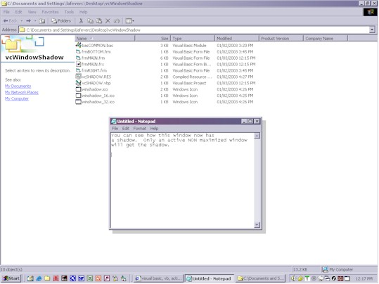



## Global Form Shadowing

### Description

Using a very basic method of moving forms around, this code will create a shadow effect to any window that currently has focus. Browser windows, Message Boxes, everything. The method is very basic. A loop just runs getting the hWnd of the window that has focus, if it is not maximized or minimized and is visible, it puts shadow forms to the right and bottom of that window and using some generic (over used) transparent code, those shadow forms are made transparent. See the screen shot of how Notepad now has a shadow on it. The shadow follows the form and for the most part, is not a bad effect. Yes more coding needs to be done for special cases and to stop some flicker now and then depending on how busy the machine is. Also the ability to through it down to the system tray (I have gotten into a habit of using a control (OCX) I made for doing that so I did not add that code here since I knew I was posting this). Anyhow, have fun, play with it if you like and make it better. If you do, I would love to see it get posted. Perhaps giving options for shadow size and color (hint).
 
### More Info
 

             |
---                |---
**Submitted On**   |2003-01-03 12:15:34
**By**             |[Clint LaFever](https://github.com/Planet-Source-Code/PSCIndex/blob/master/ByAuthor/clint-lafever.md)
**Level**          |Beginner
**User Rating**    |4.9 (49 globes from 10 users)
**Compatibility**  |VB 6\.0
**Category**       |[Complete Applications](https://github.com/Planet-Source-Code/PSCIndex/blob/master/ByCategory/complete-applications__1-27.md)
**World**          |[Visual Basic](https://github.com/Planet-Source-Code/PSCIndex/blob/master/ByWorld/visual-basic.md)
**Archive File**   |[Global\_For152329132003\.zip](https://github.com/Planet-Source-Code/clint-lafever-global-form-shadowing__1-42148/archive/master.zip)

